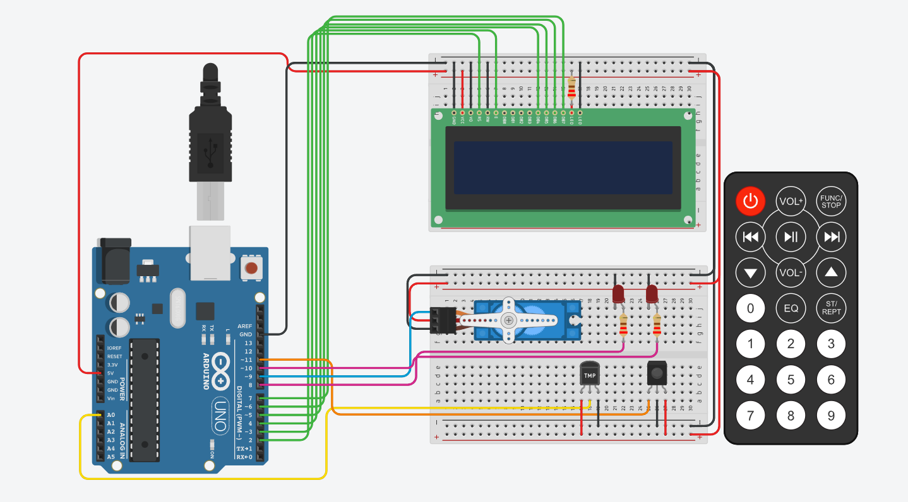

#  __Sistema de Control de Incendios__

## Resumen del proyecto. 
__El proyecto que van a ver a continuacion tiene como fin detectar la temperatur y validar si se trata de un incendio. 
Esta temperatura la podemos ir manipulando manualmente atravez de nuestro sensor de temperatura(TMP36). Tambien atravez de nuestro 
control remoto IR podremos cambiar la estacion del año, la cual sera visible en nuestro LCD. Al detectar altas temperaturas,
el sistema nos va a informar que eso se debe a un posible incendio, nuestro sistema reconoce estas altas temperaturas y acciona 
sobre ellas. Mostrando un mensaje de alerta en nuestra pantalla, prendiendo luces de emergencia (leds) y por ultimo activando
nuestro servo.__

## El circuito esta compuesto con los siguientes componentes:

* Arduino Uno
* LCD 16x2
* Sensor Temperatura(TMP36)
* Sensor IR
* Control Remoto IR
* Micro Servomoto
* 2 led
* 3 Resistencias de (220)
* 2 Placas de prueba

## 

